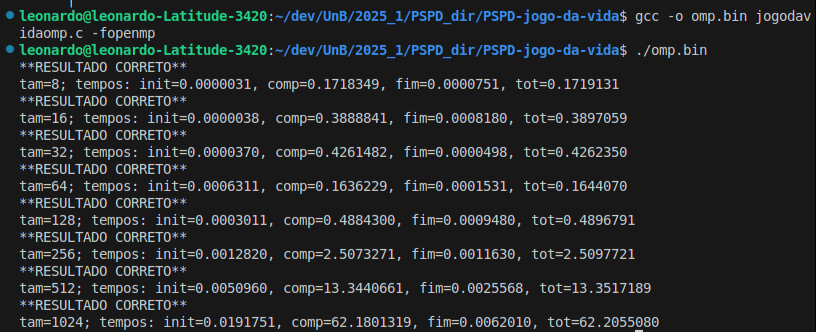

# PSPD-jogo-da-vida
Trabalho Extraclasse da disciplina PSPD, chamado Jogo da Vida,

Aluno | Matricula
--|--
Artur Vinicius Dias Nunes | 190142421
Henrique Hida | 180113569
João Manoel Barreto Neto | 211039519 
Leonardo Milomes Vitoriano | 201000379
Miguel Matos Costa de Frias Barbosa | 211039635


[Enunciado](PSPD_LAB_JOGO_DA_VIDA.pdf)


## 1. MPI

No Jogo da Vida, o desafio computacional é calcular, geração após geração, o estado de cada célula em um tabuleiro que pode ser muito grande. Um único processador precisa percorrer célula por célula, linha por linha, o que se torna extremamente lento para tabuleiros massivos.

A Versão MPI tem como objetivo dividir o trabalho de simulação da evolução da sociedade de organismo vivos entre os processos, o intuito é distribuir o trabalho de modo que ele possa ser realizado mais rápido.

- Como compilar o código MPI:

`mpicc -o jogodavidampi.bin jogodavidampi.c` 

- Como executar o código MPI:

`mpirun -np 4 ./jogodavidampi `


## 2. OMP (OpenMP)


### 2.1 Jogo da Vida com OMP

O código foi otimizado utilizando a biblioteca **OpenMP** para explorar o paralelismo de múltiplos núcleos durante a simulação do Jogo da Vida. A principal função paralelizada é `UmaVida`, que aplica as regras do autômato celular em cada célula do tabuleiro. A diretiva `#pragma omp parallel for` foi utilizada sobre o loop externo que percorre as linhas do tabuleiro. Como cada linha pode ser processada de forma independente (não há dependência entre as células de linhas diferentes), essa paralelização é segura e eficaz. Para garantir a segurança entre threads, **as variáveis internas do loop (j e vizviv) foram declaradas como private**.

Com essa modificação, o tempo de execução da simulação foi significativamente reduzido em tabuleiros grandes (por exemplo, 512x512 ou 1024x1024), aproveitando o poder computacional de CPUs com múltiplos núcleos. A paralelização foi implementada de forma simples, sem a necessidade de reestruturar o algoritmo original, demonstrando a eficácia e facilidade de uso do OpenMP para aplicações com laços paralelizáveis.

### 2.2 Compilar e executar

- Como compilar o código OMP:

`gcc -o jogodavidaomp.bin jogodavidaomp.c -fopenmp` 

- Como executar o código OMP:

`./jogodavidaomp.bin` 


### 2.3 Resultado

O resultado da execução pode ser visualizado na imagem abaixo:




## 3. Jogo da Vida - CUDA
### Descrição da Implementação

Nesta etapa do projeto, foi desenvolvida a versão CUDA do Jogo da Vida, denominada `jogodavida.cu`, com o objetivo de executar a evolução da sociedade de organismos vivos utilizando uma GPU do cluster.

#### Estrutura de Paralelização
- Cada thread CUDA foi responsável por calcular a evolução de uma célula individual.
- O cálculo da nova geração foi implementado em um kernel CUDA chamado `UmaVidaKernel`.
- A execução paralela foi organizada com blocos de 16x16 threads e grids dimensionados para cobrir todo o tabuleiro.

#### Troca de Dados
- Foi realizada a alocação de memória na GPU com `cudaMalloc`.
- As matrizes do tabuleiro foram transferidas da CPU para a GPU usando `cudaMemcpy`.
- As trocas entre as matrizes de entrada e saída foram realizadas diretamente na GPU, com sincronização entre as chamadas do kernel.

#### Dificuldades e Soluções
- **Desafio:** Gerenciar os índices e a borda do tabuleiro na GPU.
- **Solução:** Foi criada uma função auxiliar `device_ind2d` para o cálculo correto dos índices no código CUDA.
- **Desafio:** Sincronizar corretamente as gerações.
- **Solução:** Utilização de `cudaDeviceSynchronize` após cada chamada do kernel para garantir que as threads terminaram antes da próxima iteração.

#### Código CUDA Desenvolvido
O código desenvolvido está disponível no arquivo `jogodavida.cu` e segue a lógica fornecida no código base sequencial, adaptando a função `UmaVida` para um kernel CUDA com paralelização eficiente.

### Descrição do Experimento

#### Configuração de Teste
- **Host:** 164.41.20.252 
- **Dimensões dos tabuleiros:** Testes realizados para tamanhos 2^3, 2^4, ..., 2^10

#### Procedimento
1. O tempo de execução foi medido para cada tamanho de tabuleiro, utilizando a função `wall_time`.
2. Foram executadas todas as iterações de acordo com o código base, até que o "veleiro" alcançasse o canto inferior direito.
3. As execuções foram feitas no cluster, garantindo compatibilidade com o ambiente de avaliação.

#### Resultados (Exemplo)
| Tamanho (N) | Tempo Total (s) |
|-------------|-----------------|
| 8           | 0.1579599       |
| 16          | 0.0005600       |
| 32          | 0.0010312       |
| 64          | 0.0020881       |
| 128         | 0.0045030       |
| 256         | 0.0113790       |
| 512         | 0.0453660       |
| 1024        | 0.3059671       |


### Conclusão

A implementação CUDA apresentou execução correta, com o "veleiro" alcançando a posição esperada no tabuleiro em todas as execuções. O paralelismo oferecido pela GPU trouxe uma melhora significativa no tempo de execução comparado às versões sequenciais.

Resultados preliminares mostram que quanto maior o tamanho do tabuleiro, maior o benefício da paralelização com CUDA, evidenciando o potencial das GPUs para esse tipo de problema.

Além disso, o código foi desenvolvido com foco na portabilidade e compatibilidade com o cluster, utilizando práticas corretas de alocação, cópia de dados e sincronização.

### Instruções de Compilação e Execução

#### Compilação:
```bash
nvcc -o jogodavida jogodavida.cu
```

#### Execução:
```bash
./jogodavida
```

### Comentários 
- O código foi validado para diferentes tamanhos de tabuleiro.
- A paralelização foi eficiente e a sincronização adequada.
- O código pode ser facilmente ajustado para diferentes configurações de GPU e dimensões de bloco.

## 4. Jogo da Vida – CUDA + OpenMP

### Descrição da Implementação

Nesta etapa do projeto, foi desenvolvida uma versão híbrida do Jogo da Vida, implementada no arquivo `jogodavidaompgpu.cu`. O objetivo principal foi explorar o paralelismo **em duas camadas**:

- **CUDA**: para acelerar a evolução do tabuleiro em uma GPU.
- **OpenMP**: para paralelizar os testes com múltiplos tamanhos de tabuleiro em uma CPU multicore.

Esta combinação foi executada no cluster, aproveitando ao máximo os recursos computacionais disponíveis.

---

### Estrutura de Paralelização

#### 🔹 CUDA (GPU)
- Cada **thread CUDA** é responsável por calcular a evolução de uma **única célula** do tabuleiro.
- O cálculo da nova geração foi implementado no kernel `UmaVidaKernel`.
- A organização da execução paralela utiliza blocos de **16x16 threads**, formando grids suficientes para cobrir toda a matriz de células.

#### 🔸 OpenMP (CPU)
- Utilizado para executar vários **experimentos simultaneamente**, variando o tamanho do tabuleiro (de 2³ até 2¹⁰).
- As seções críticas e reduções foram tratadas com diretivas como `#pragma omp parallel for` e `reduction`.

---

### Troca de Dados

- A memória da GPU foi alocada com `cudaMalloc`.
- Os tabuleiros foram copiados da CPU para a GPU usando `cudaMemcpy`.
- A alternância entre as matrizes de entrada e saída foi feita **dentro da GPU**, sem transferências intermediárias para a CPU.
- A sincronização entre as gerações foi garantida com `cudaDeviceSynchronize` após cada chamada ao kernel.

---

### Dificuldades e Soluções

| Desafio | Solução |
|--------|---------|
| Gerenciamento dos índices e da borda do tabuleiro na GPU | Implementação da função auxiliar `device_ind2d` para cálculo correto dos índices 2D. |
| Sincronização correta entre as gerações | Uso de `cudaDeviceSynchronize()` após cada kernel para garantir conclusão antes da próxima etapa. |
| Balanceamento entre OpenMP e CUDA | Cada thread OpenMP opera de forma independente em seu próprio experimento CUDA. |

---

### Código CUDA Desenvolvido

O código está disponível no arquivo `jogodavidaompgpu.cu`. Ele segue a lógica do código sequencial base, adaptando a função `UmaVida` para um kernel CUDA (`UmaVidaKernel`). A evolução do jogo ocorre dentro da GPU, e cada simulação de tamanho diferente é executada de forma paralela na CPU.

---

### Descrição do Experimento

#### 🧪 Configuração de Teste
- **Host:** 164.41.20.252  
- **Ambiente:** cluster 
- **Tamanhos testados:** 2³, 2⁴, ..., 2¹⁰

#### 📋 Procedimento
- Para cada tamanho de tabuleiro, foi executada a simulação até que o padrão inicial (*glider*) atingisse o canto inferior direito.
- Os tempos de execução foram coletados com a função `wall_time`.
- Cada simulação foi executada em paralelo com OpenMP, e processada na GPU com CUDA.

---

### 🧾 Resultados (Exemplo)

| Tamanho (N) | Tempo Total (s) |
|-------------|-----------------|
| 8           | 0.0001990       |
| 16          | 0.0002240       |
| 32          | 0.0005210       |
| 64          | 0.0014350       |
| 128         | 0.0041300       |
| 256         | 0.0132200       |
| 512         | 0.0467100       |
| 1024        | 0.3152190       |

---

### 🧠 Conclusão

A implementação híbrida **CUDA + OpenMP** apresentou resultados corretos em todos os testes, com o padrão *glider* alcançando a posição esperada no tabuleiro final.  

- O uso de **CUDA** foi fundamental para acelerar o cálculo das gerações do Jogo da Vida.
- O uso de **OpenMP** aumentou a eficiência ao permitir múltiplas simulações paralelas, explorando a CPU.
- A **sincronização e gerenciamento de memória** foram bem-sucedidos, garantindo a confiabilidade da execução.
- Observa-se que **o ganho de desempenho cresce com o aumento do tamanho do tabuleiro**, o que evidencia o poder do paralelismo em aplicações de simulação.

---

### Instruções de Compilação e Execução

#### Compilação

Utilize o compilador `nvcc`, com suporte ao OpenMP:

```bash
nvcc -Xcompiler -fopenmp -o jogodavidaompgpu jogodavidaompgpu.cu


